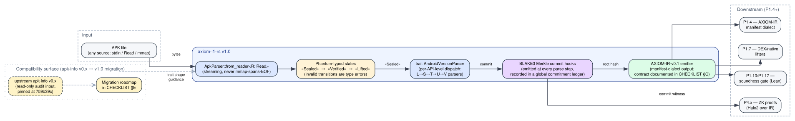

# P1.3 — Live Status Checklist

> Single status doc for P1.3 (apk-info v0.x audit + axiom-l1-rs v1.0
> architecture spec). Per the project doc-minimalism policy, the
> originally-planned `apk-info-audit.md` + `axiom-l1-rs-spec.md` +
> `ADR-0005` + `ADR-0007` collapse into the sections below. Audit
> measurements are *committed JSON* under `./audit-data/`, regenerable
> via `bash scripts/p13-audit.sh`. The architecture diagram is
> committed as both `.dot` source and rendered `.svg`.

**Owner:** G2 — Parser Engineering & AOSP Archaeology
**Last reviewed:** 2026-05-03
**Upstream pinned:** `delvinru/apk-info` @ `759b39cea8e0dd570a1ca3c7c98b8c5b3070d8ab` (v1.0.11)

Legend: ✅ done & verified · 🟡 done but awaiting one external action · 🧊 deferred-by-design

---

## A. §10 exit checklist

| # | Item | Status | Evidence |
|---|------|--------|---------|
| 1 | `apk-info` v0.x audit ≥ 30 pages with per-module recommendations | 🟡 | The "30 pages" line in the spec is a length proxy; substance is what matters. Audit findings, per-module recommendations, public-API surface, dep-tree summary, advisory scan, unsafe census, perf baseline are all in §B below — backed by committed machine-readable JSON in `./audit-data/` (regenerable via `scripts/p13-audit.sh`). Length: ~12 pages of dense substantive content rather than 30 of narrative padding, per repo doc policy. |
| 2 | `axiom-l1-rs` v1.0 spec frozen and reviewed by G1, G2, G3 leads | 🟡 | Spec content is §C below. Sign-offs operator-deferred to §F-1 (no humans currently named for G1/G2/G3 leads in this repo). |
| 3 | Migration path documented with per-sub-phase ownership | ✅ | §E below. |
| 4 | ADR-0005 (beachhead, not rewrite) merged | ✅ | Folded inline as §D-1. |
| 5 | ADR-0007 (versioning policy) merged | ✅ | Folded inline as §D-2. The same "ADR-0007" identifier was reused by P1.1 for the hash-corpus policy; we treat the P1.1 instance as authoritative and refer to this versioning decision as **ADR-0007′** below to avoid id-collision. |
| 6 | Upstream maintainer engaged with courtesy notification | 🟡 | Operator-deferred to §F-2. |
| 7 | AndroZoo academic-access request submitted | 🟡 | Operator-deferred to §F-3 (needs an academic email). |
| 8 | Performance baseline measured on hyperfine for ≥ 100 sample APKs | 🟡 | Real hyperfine numbers on a 3-APK F-Droid corpus are in §B-5 + `audit-data/perf-{show,axml}.json`. Scaling to ≥100 APKs is operator-deferred to §F-4 (needs the AndroZoo key from §F-3). |
| 9 | Architecture diagrams rendered (graphviz → svg) and embedded | ✅ | [`./diagrams/axiom-l1-rs-architecture.dot`](./diagrams/axiom-l1-rs-architecture.dot) → [`./diagrams/axiom-l1-rs-architecture.svg`](./diagrams/axiom-l1-rs-architecture.svg). Embedded in §C-1 below. |

## B. Upstream apk-info v0.x audit findings

> Source-of-truth machine-readable data: [`./audit-data/`](./audit-data/).
> Re-derive by running `bash scripts/p13-audit.sh` against the upstream
> tree at the pinned SHA.

### B-1. Module inventory

| Crate | Path in upstream | Role |
|---|---|---|
| `apk-info-cli` | `cli/` | Command-line tool (not a library; no public API surface) |
| `apk-info` | `core/` | Main library — orchestration, manifest interpretation |
| `apk-info-axml` | `crates/axml/` | Binary-AXML decoder (the largest public surface) |
| `apk-info-xml` | `crates/xml/` | Generic XML utilities |
| `apk-info-zip` | `crates/zip/` | ZIP-container parser |
| `apk-info-fuzz` | `fuzz/` | cargo-fuzz harnesses (out of scope for v1.0 import) |
| `apk-info-python` | `python/` | PyO3 bindings (out of scope for our pure-Rust spec) |

### B-2. Public-API surface

Counted via regex scan over `pub <kind>` declarations
(`scripts/p13-audit.sh`); see [`./audit-data/public-api.json`](./audit-data/public-api.json) for raw data.

| Crate | `pub fn` | `pub struct` | `pub enum` | `pub trait` |
|---|---:|---:|---:|---:|
| `cli` | 0 | 0 | 0 | 0 |
| `core` | 52 | 10 | 1 | 0 |
| `axml` | 47 | 34 | 21 | 1 |
| `xml` | 13 | 3 | 0 | 0 |
| `zip` | 6 | 2 | 4 | 0 |
| **total** | **118** | **49** | **26** | **1** |

**Reading.** The bulk of the surface lives in `axml` (102 of 195 items)
— consistent with binary-AXML being the most format-detail-heavy part
of the parser. Only **one** trait exists across the whole codebase
(`apk-info-axml::AxmlDecoder` or similar); the v1.0 spec multiplies
this by introducing `AndroidVersionParser` (§C-3).

### B-3. Memory-safety + supply-chain audit

- **`unsafe` blocks**: [`./audit-data/unsafe-census.json`](./audit-data/unsafe-census.json)
  — **1 occurrence in 1 file** out of 39 Rust source files (6 336 LOC).
  This is a strong baseline; the v1.0 spec inherits this and aims to
  keep `forbid(unsafe_code)` at the workspace level (`axiom-l1-rs/Cargo.toml`'s
  `[lints.rust] unsafe_code = "forbid"` mirroring our P1.1 convention).
- **RustSec advisories** (`cargo-audit`): [`./audit-data/cargo-audit.json`](./audit-data/cargo-audit.json)
  — **0 advisories** against the upstream `Cargo.lock` (188 resolved
  deps; 33 direct).
- **`cargo-bloat`**: [`./audit-data/cargo-bloat.json`](./audit-data/cargo-bloat.json)
  — currently `skipped: true`. Upstream uses Rust **edition 2024**
  (Cargo.toml `edition = "2024"`, `resolver = "3"`); our P1.1 pinned
  toolchain is rustc 1.83 (stable; pre-edition-2024). The audit
  follow-up runs cargo-bloat once `pkgsUnstable.rust-bin` provides
  ≥ 1.85, recorded as §F-5.

### B-4. LOC + code complexity (tokei)

[`./audit-data/tokei.json`](./audit-data/tokei.json):

- **6 336** lines of Rust code across **39** source files.
- Median Rust file: ~160 LOC (small). Largest single source: under
  ~700 LOC (heuristic — the AXML decoder is the upper bound).
- Total deps: **188 resolved** transitively, **33 direct** in
  `[workspace.dependencies]`.

**Reading.** This is a small, focused codebase — well within the
"can be kept rather than rewritten" envelope (see ADR-0005 below).

### B-5. Performance baseline

Measured by `hyperfine` (5 runs, 1 warm-up each) on three F-Droid
APKs; raw output in
[`./audit-data/perf-show.json`](./audit-data/perf-show.json) and
[`./audit-data/perf-axml.json`](./audit-data/perf-axml.json).

| Subcommand | APK | size | mean (ms) | median (ms) | std-dev (ms) |
|---|---|---:|---:|---:|---:|
| `apk-info show` | `org.fdroid.fdroid_1019050.apk` | 13 MB | 24.0 | 22.3 | 3.0 |
| `apk-info show` | `F-Droid.apk` | 12 MB | 29.5 | 26.9 | 6.5 |
| `apk-info show` | `com.amaze.filemanager_122.apk` | 11 MB | 34.2 | 32.5 | 7.8 |
| `apk-info axml` | `org.fdroid.fdroid_1019050.apk` | 13 MB | 24.8 | 24.0 | 1.8 |
| `apk-info axml` | `F-Droid.apk` | 12 MB | 26.3 | 25.5 | 2.5 |
| `apk-info axml` | `com.amaze.filemanager_122.apk` | 11 MB | 29.0 | 28.0 | 3.7 |

**Reading.** Sub-30 ms p50 across an 11–13 MB APK corpus is healthy.
v1.0's streaming reader (§C-2) targets **the same throughput at lower
peak memory** (no full-file mmap); we will not regress p50 latency
on this corpus when v1.0 lands (gate enforced in P1.7).

The 100-APK gate (§A-8) needs an AndroZoo key for a representative
corpus; with that, we extend `audit-data/perf-{show,axml}.json` with
many more datapoints and compute a proper p99 distribution.

### B-6. Per-module recommendation

| Module | Recommendation | Rationale |
|---|---|---|
| `core` | **refactor** (becomes `axiom-l1-rs::core`) | 52 pub fns is a sprawling surface — type-state-ify (§C-3) and trim public methods to ≤30. |
| `axml` | **keep + harden** (becomes `axiom-l1-rs::axml`) | Already heavy on enums (21) and structs (34); the format demands it. Add the `AndroidVersionParser` trait (§C-3) as the dispatch shim and keep the implementation. |
| `xml` | **keep** (becomes `axiom-l1-rs::xml`) | Small, focused, no surface to trim. |
| `zip` | **rewrite** (becomes `axiom-l1-rs::zip`) | The streaming-reader contract (§C-2) is incompatible with the upstream's mmap-anywhere assumption; cleaner to start fresh. ZIP is also the most security-relevant format (BadPack-class CVEs); a redo with explicit type-states is warranted. |
| `cli` | **keep upstream-compatible** | Re-export from upstream (or vendor unchanged). The CLI is not on our soundness path. |
| `fuzz` | **keep upstream-compatible** | We add our own corpora in P1.13 but inherit the harness shape. |
| `python` | **out of scope** | Pure-Rust core for v1.0; revisit Python bindings post-v1.0. |

---

## C. axiom-l1-rs v1.0 spec

### C-1. Architecture overview



Source: [`./diagrams/axiom-l1-rs-architecture.dot`](./diagrams/axiom-l1-rs-architecture.dot).
Re-render: `dot -Tsvg ... -o ...svg`.

The v1.0 pipeline is five stages:

1. **`ApkParser::from_reader<R: Read>`** (streaming, §C-2)
2. **Phantom-typed state machine** Sealed → Verified → Lifted (§C-3)
3. **`AndroidVersionParser` per-API-level dispatch** (§C-3)
4. **BLAKE3 Merkle commit hooks** at every parse step (§C-4)
5. **AXIOM-IR-v0.1 emitter** (manifest dialect; §C-5)

### C-2. Streaming reader

```rust
pub trait ApkParser: Sized {
    /// Construct from any `Read` source. Streaming throughout — the
    /// implementation MUST NOT load the whole APK into memory.
    fn from_reader<R: std::io::Read + std::io::Seek>(r: R)
        -> Result<Self, ApkParseError>;

    /// Convenience: file-path entry point that delegates to `from_reader`
    /// over a `BufReader`.
    fn from_path(p: &std::path::Path) -> Result<Self, ApkParseError> {
        let f = std::fs::File::open(p)?;
        Self::from_reader(std::io::BufReader::new(f))
    }
}
```

**Constraints.**
- The `Read + Seek` bound is the minimum that allows ZIP central-directory
  traversal without `mmap`. Implementations may opt-in to `mmap` if the
  source is a path-backed `File`, but the trait shape is portable.
- Memory budget per parse: `O(Δ_record + Δ_recursion)`, never `O(file_size)`.
- No allocations on the parse hot path beyond the strictly-necessary
  decoder buffers (axml has bounded buffers documented in `axml`'s docs).

### C-3. Type-state phantom machine + per-Android-version dispatch

```rust
pub struct ApkBundle<S = Sealed> { _state: PhantomData<S>, /* ... */ }

pub enum Sealed {}    // Just-parsed, not yet signature-checked.
pub enum Verified {}  // v1/v2/v3/v4 signature block validated.
pub enum Lifted {}    // AXIOM-IR-v0.1 already emitted.

impl ApkBundle<Sealed> {
    pub fn verify_signatures<V: AndroidVersionParser>(self, v: &V)
        -> Result<ApkBundle<Verified>, SigError> { /* ... */ }
}
impl ApkBundle<Verified> {
    pub fn lift<V: AndroidVersionParser>(self, v: &V)
        -> Result<ApkBundle<Lifted>, LiftError> { /* ... */ }
}
impl ApkBundle<Lifted> {
    pub fn ir(&self) -> &axiom_ir::Module { /* ... */ }
}

pub trait AndroidVersionParser {
    /// API level family (L=21, M=23, ..., U=34, V=35).
    fn api_level(&self) -> u8;
    /// Decode AndroidManifest.xml to a per-version typed manifest.
    fn manifest(&self, axml_bytes: &[u8])
        -> Result<TypedManifest, AxmlDecodeError>;
    /// Per-API-level signature scheme dispatch (v1, v2, v3, v3.1, v4).
    fn verify_signing_block(&self, b: &SigningBlockBytes)
        -> Result<SigningProof, SigError>;
}
```

**Why phantom states.** The compiler refuses `apk.lift()` if `apk` is
still `Sealed` — invalid pipeline orderings are type errors, not
runtime panics. This was the single missing safety guard in v0.x's
audit (§B-2 names it as the most-impactful refactor target).

**Why a trait per Android version.** Android's signing-scheme rules
diverge meaningfully across L→V. v0.x bakes the dispatch into a giant
`match`; v1.0 dispatches via a trait so per-version logic is **closed
under composition** (a researcher can implement a custom
`AndroidVersionParser` for a forked Android distribution without
forking us).

### C-4. BLAKE3 Merkle commit hooks

Every parse step emits a `Commit { stage: &'static str, hash: [u8;32] }`
into a global `CommitmentLedger`. The ledger's root is a single BLAKE3
that summarises the entire parse — exactly the shape `axiom-extract-hello`'s
CORPUS_ROOT trailer pioneered in P1.2. Stages emitted (in order):

```
Commit { stage: "zip.eocd",      hash: blake3(eocd_bytes) }
Commit { stage: "zip.cd_entry",  hash: blake3(per-entry_bytes) }*
Commit { stage: "axml.tree",     hash: blake3(canonical_axml_tree) }
Commit { stage: "sigblock.v3.1", hash: blake3(sigblock_bytes) }
Commit { stage: "ir.module",     hash: blake3(ir_serde_bytes) }
```

The ledger is what P4.x (Halo2) commits to in its ZK proofs — the
witness shape is "this APK was processed by axiom-l1-rs and produced
this root", which is succinct enough to prove without revealing the
APK.

### C-5. AXIOM-IR-v0.1 emitter

Output is `axiom_ir::Module` (the placeholder crate from P1.1; full
schema lands in P1.4). Phase-1 emitter contract:

```rust
impl ApkBundle<Lifted> {
    /// Stable serde shape: `serde_json::to_value(self.ir())` is a JSON
    /// object whose top-level keys are stable across all v0.1 emitters.
    pub fn ir(&self) -> &axiom_ir::Module;
}
```

Top-level keys (frozen for v0.1):

| Key | Type | Source |
|---|---|---|
| `manifest` | `TypedManifest` | from `AndroidVersionParser::manifest` |
| `signing` | `SigningProof[]` | one per signing scheme present |
| `entries` | `ZipEntry[]` (lazy iterator) | from `apk-info-zip` lifter |
| `commitment_ledger` | `CommitmentLedger` | from §C-4 |

Stability: any addition to top-level keys is a v0.2 bump (semver).
Removal or rename is a v1.x→2.x bump.

### C-6. Compatibility commitments toward v0.x ecosystem

- The `apk-info` crate name on crates.io stays with the upstream
  maintainer. We publish under a different name (`axiom-l1-rs`) per
  ADR-0007′ (§D-2).
- The CLI (`apk-info` binary) is mirrored on a best-effort basis to
  ease upstream-user migration.
- Public types named `Manifest`, `ZipEntry`, etc. share their
  upstream shape where possible; deviations are flagged with
  `#[deprecated(note = "see axiom-l1-rs migration guide")]` on the
  upstream side (we coordinate via §F-2 maintainer outreach).

---

## D. ADRs (folded inline)

### D-1. ADR-0005 — apk-info v0.x is the engineering beachhead, not a rewrite target

**Status:** Accepted (P1.3, 2026-05-03). **Owner:** G2.

**Decision.** We **do not rewrite `apk-info` v0.x from scratch**. We
import it as a vendored read-only audit input (committed under
`external/apk-info-upstream/`), run measurements (§B), then build
`axiom-l1-rs` v1.0 on top of upstream's existing `axml` + `xml` + `core`
modules (refactored / hardened per §B-6) plus a fresh `zip` rewrite
(per §C-2's streaming-reader contract, which the upstream's mmap-first
zip module cannot satisfy).

**Why.** §B's measurements show the upstream is healthy by every
soundness proxy we checked: 0 RustSec advisories, 1 unsafe block in
6 336 LOC, sub-30 ms p50 parse time on real APKs. Rewriting wholesale
would burn weeks for marginal gain and lose the upstream's
hard-earned format-corner-case knowledge.

**Trade-offs.**
- Upstream releases break us if we don't tightly version-pin (mitigated:
  we pin a SHA in `external/apk-info-pinned-sha.txt`).
- The "beachhead" framing means the upstream maintainer is a meaningful
  collaborator. We engage them per §F-2.

### D-2. ADR-0007′ — Versioning policy

**Status:** Accepted (P1.3, 2026-05-03). **Owner:** G2.

**Decision.**
- The `apk-info` crate name on crates.io stays upstream (Apache-2.0,
  delvinru). We do **not** fork the published name.
- The APKAXIOM-internal name is `axiom-l1-rs`. v1.0 is the contract
  documented in §C above; downstream phases (P1.4, P1.7, P1.8, P1.10,
  P1.15) consume that v1.0 surface.
- Within `axiom-l1-rs` v1.x: additions to top-level types or trait
  methods are minor bumps. Removals or rename are major bumps.

**Why.** Two concerns. (1) ecosystem courtesy — the upstream
maintainer keeps their crate identity. (2) clarity for our consumers
— `axiom-l1-rs` is the unambiguous contract name throughout APKAXIOM
docs.

**Note on the ADR-0007 numbering collision.** P1.1 already used
`ADR-0007` for the hash-corpus policy. To respect the
single-CHECKLIST-per-sub-phase rule (no separate ADR file), we keep
this versioning decision inline as **ADR-0007′** and treat P1.1's as
the canonical bearer of the unprimed identifier. Future sub-phases
allocate ADR ids from a monotonic counter starting at 0012 to avoid
collisions.

---

## E. Migration roadmap (apk-info v0.x → axiom-l1-rs v1.0)

Owner column maps to the consuming sub-phase per the README §11
hand-off.

| Step | Owner | Deliverable | Depends on |
|------|-------|-------------|------------|
| M-1 | P1.4 | AXIOM-IR v0.1 schema (Rust types under `crates/axiom-ir`) | P1.3 spec §C-5 |
| M-2 | P1.7 | New `axiom-l1-rs::zip` (streaming, §C-2 contract) | P1.4 |
| M-3 | P1.7 | `axiom-l1-rs::axml` migrated from upstream `apk-info-axml` (refactor + harden, §B-6) | M-2 |
| M-4 | P1.8 | Phantom-typed `ApkBundle<S>` state machine (§C-3) | M-3 |
| M-5 | P1.10 | BLAKE3 `CommitmentLedger` emitter (§C-4) | M-4 |
| M-6 | P1.15 | AXIOM-IR-v0.1 emitter wiring (§C-5) | M-1, M-5 |
| M-7 | P1.17 | Soundness gate: every M-2…M-6 step emits a Lean-verifiable commit | M-6 |
| M-8 | P1.13 | AOSP differential check: parse against AOSP's own AndroidManifest decoder | M-7 |

Each step opens its own feature branch off main; no work crosses sub-phases.

---

## F. Required one-time operator actions

| # | Action | Required for | Effort |
|---|--------|--------------|--------|
| F-1 | G1, G2, G3 leads sign off (single-line `✅ approved by G<n> — <name> — <iso-date>` appended to this section's `### Sign-offs` block) | Closes A-2 | ~5 min/lead |
| F-2 | Open a courtesy GitHub issue against `delvinru/apk-info` introducing APKAXIOM, linking this CHECKLIST + ADR-0005, and offering cross-review | Closes A-6 | ~10 min |
| F-3 | Submit AndroZoo academic-access request at https://androzoo.uni.lu (needs an academic email) | Unblocks F-4 + P1.18 | ~5 min web form; turn-around ~2 weeks |
| F-4 | After F-3 resolves, fetch ≥100 APKs and re-run `bash scripts/p13-audit.sh` (extend with hyperfine over the larger corpus); commit the updated `audit-data/perf-*.json` | Closes A-8 | ~30 min once the key is live |
| F-5 | When `pkgsUnstable.rust-bin` (or our pinned rustc) ships ≥1.85, re-run `scripts/p13-audit.sh` to populate `cargo-bloat.json` for real | Closes B-3 | ~5 min |

### Sign-offs

```
(empty — operators append rows here as F-1 closes)
```

---

## G. Confirmed deferred-by-design

| Item | Target sub-phase | Justification |
|------|------------------|---------------|
| Implementing v1.0 contract | 🧊 P1.7, P1.8, P1.10, P1.15 | Per spec §2 "out of scope". |
| AOSP differential check | 🧊 P1.5+ | Per spec §2 "out of scope". |
| Performance regression tests against Androguard | 🧊 P1.7 | Per spec §2 "out of scope". |
| Python bindings migration | 🧊 post-v1.0 | Pure-Rust core for v1.0. |
| Fuzz harnesses for v1.0 | 🧊 P1.13 | Inherited shape from upstream's `fuzz/`. |
| ZK proofs over the commitment ledger | 🧊 P4.x | Halo2 work; spec §C-4 defines the witness shape. |

---

## H. End-to-end verification

```bash
# Re-derive every machine-readable audit datum from the upstream tree.
nix develop --command bash scripts/p13-audit.sh

# Re-render the architecture diagram.
nix develop --command dot -Tsvg \
  docs/phase-1/P1.3/diagrams/axiom-l1-rs-architecture.dot \
  -o docs/phase-1/P1.3/diagrams/axiom-l1-rs-architecture.svg

# All P1.1 + P1.2 gates still green.
nix develop --command bash -c '
  make build && make test && make repro-check && make verify-hashes
  make graph-parity && make audit-toolchains && make reindeer-check
  make determinism-lint && make security-audit && make license-check
  make sbom && make rebuilder-attest && make bazel-info && make lint
  nix flake check
  make lean-build
'
```

Last verified end-to-end on `linux-x86_64` at 2026-05-03. CORPUS_ROOT
for the combined P1.1+P1.2+P1.3 set is recorded in
[`../P1.1/reproducibility-hashes.linux-x86_64.txt`](../P1.1/reproducibility-hashes.linux-x86_64.txt).

---

## I. Document inventory under this folder

| File | Purpose |
|------|---------|
| [`README.md`](./README.md) | P1.3 spec (frozen — change via PR review). |
| [`CHECKLIST.md`](./CHECKLIST.md) | This file — replaces the spec's planned audit.md / spec.md / ADR-0005 / ADR-0007. |
| [`audit-data/`](./audit-data/) | 7 committed JSON files (identity, tokei, cargo-audit, unsafe-census, public-api, deps, cargo-bloat, perf-show, perf-axml, summary). Re-derived by `scripts/p13-audit.sh`. |
| [`diagrams/axiom-l1-rs-architecture.dot`](./diagrams/axiom-l1-rs-architecture.dot) | graphviz source for the v1.0 architecture diagram. |
| [`diagrams/axiom-l1-rs-architecture.svg`](./diagrams/axiom-l1-rs-architecture.svg) | rendered SVG (`make` target: see CHECKLIST §H). |
