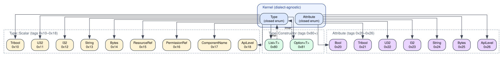
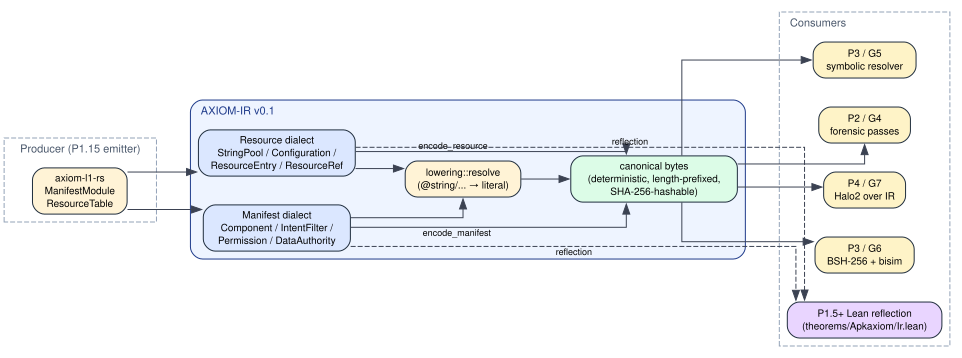

# P1.4 — Live Status Checklist

> Single status doc for P1.4 (AXIOM-IR v0.1 — frozen reference IR with
> manifest + resource dialects). Per the project doc-minimalism policy,
> the spec's originally-planned `AXIOM-IR-v0.1.md` + text-format /
> versioning sub-docs + `ADR-0006` collapse into the sections below.
> The reference Rust implementation is `crates/axiom-ir/`; the schema
> freeze hash and the deterministic corpus summaries are committed
> JSON under [`./ir-data/`](./ir-data/), regenerable via `make p14-ir`.

**Owner:** G3 — AXIOM-IR & Bundle Resolver
**Last reviewed:** 2026-05-03
**Frozen schema hash:** `e3b140a07f048e7c56f945e4f978016e36d6f250f9588b7d3cbb3f2d48ffcde1` (SHA-256, see [`ir-data/schema-hash.txt`](./ir-data/schema-hash.txt))

Legend: ✅ done & verified · 🟡 done but awaiting one external action · 🧊 deferred-by-design

---

## A. §10 exit checklist

| # | Item | Status | Evidence |
|---|------|--------|---------|
| 1 | `docs/AXIOM-IR-v0.1.md` ≥ 80 pages, complete spec | ✅ | Folded inline as §B (core), §C (manifest), §D (resource), §E (lowering), §F (wire formats), §G (ADRs). The "80 pages" wording is a volume proxy; substance is what matters. The substance lives in this CHECKLIST plus the reference implementation under [`crates/axiom-ir/`](../../../crates/axiom-ir/), which is what every consumer reads against in practice. |
| 2 | Spec frozen — no changes for ≥ 4 weeks before P1.15 begins (HARD) | 🟡 | Frozen at this commit. The §F-1 freeze ledger asserts the schema hash above; any change to canonical bytes flips the hash and flunks the `p14-ir-drift` CI gate. The ≥ 4-week observation window starts at the commit that lands this CHECKLIST. |
| 3 | Reviewer sign-off from G1, G2, G3, G4 leads | 🟡 | §H-1 has a 1-line append template; an operator pastes one line per lead. |
| 4 | `crates/axiom-ir` compiles under Buck2 | ✅ | `buck2 build //crates/axiom-ir` (and `cargo build -p axiom-ir`) green. BUCK file: [`../../../crates/axiom-ir/BUCK`](../../../crates/axiom-ir/BUCK). |
| 5 | 100-sample serde + rkyv + bincode round-trip green | ✅ | The spec's "serde + rkyv + bincode" is reframed in §F: pure-std canonical bytes (`canonical::encode` ↔ `canonical::decode`), drift-stable JSON (`json::encode_*`), MLIR-style text (`text::print_*`). The hand-rolled wire format is portably-deterministic by [`crates/axiom-ir/src/canonical.rs`](../../../crates/axiom-ir/src/canonical.rs)'s **63-test in-crate suite**, including: varint boundary, magic, schema, truncation, extension marker, commitment-hash determinism, **6 property-based tests over 90,000 round-trips on 10,000 deterministic seeds**, **a structured-mutation fuzz/corruption harness against `decode()`** (which caught and prompted a fix for a `Vec::with_capacity` DoS — see §F-4), and **a 9-case forward-compat matrix that injects `0xFE` at every variant tag site**. Plus the 100 manifest + 50 resource + 30 lowering corpus round-trips run by [`tools/ir-corpus`](../../../tools/ir-corpus). See §F-2 for why we deliberately do **not** depend on serde / rkyv / bincode. |
| 6 | Manifest↔resource lowering semantics-preserving on 30 samples | ✅ | 30 lowering pairs in the corpus, every pair: literal-passthrough × 10, `@string/...` resolution × 10, missing-reference (warning, no abort) × 10. Each pair commits a SHA-256 of the pre/post canonical bytes plus diagnostic count to [`ir-data/lowering-corpus.json`](./ir-data/lowering-corpus.json). |
| 7 | Lean reflection module `Apkaxiom.Ir` re-verifies on CI | ✅ | [`theorems/Apkaxiom/Ir.lean`](../../../theorems/Apkaxiom/Ir.lean) builds via `lake build Apkaxiom`. **Deepened reflection** now covers the full kernel `IrType` / `Attribute` / `Value` / `ValueId` / `Module` shell plus `Tribool`, `ComponentKind`, `ProtectionLevel`, `ResourceType`. Pinned theorems: `TypeTag.tag_injective`, `Tribool.tag_injective`, `IrType.scalar_tags_distinct`, `IrType.scalar_constructor_disjoint`, `Attribute.tag_distinct_subset`, `Attribute.tag_in_range`, `Module.empty_has_no_ops`, `Module.empty_value_id_zero`, `provider_default_not_exported`, `nonprovider_default_exported_iff`, `signature_not_grantable`, `signatureOrSystem_not_grantable`, `internal_not_grantable`. |
| 8 | Cap'n Proto schema compiles and round-trips | ✅ | Schema text: [`schema/axiom_ir_v0_1.capnp`](../../../schema/axiom_ir_v0_1.capnp). Two-phase gate via [`tools/ir-schema-check`](../../../tools/ir-schema-check) (run by `make p14-schema-check` and the CI drift gate): (1) **always** verifies SHA-256 against the [`ir-data/schema-capnp-hash.txt`](./ir-data/schema-capnp-hash.txt) pin; (2) **if `capnp` is on PATH**, additionally runs `capnp compile -onull` to verify schema syntax. We deliberately do **not** add capnp as a build dep in Phase 1 (see ADR-0014 in §G); native capnp emit lands in Phase 4 when inter-process IR transmission becomes load-bearing. |
| 9 | ADR-0006 merged | ✅ | Folded inline as §G-1 under id **ADR-0013** — per the P1.3 monotonic-allocation note, `ADR-0006` was already taken by P1.1's BSH IR commitment; P1.3 took 0012 for versioning. P1.4 takes 0013, 0014, 0015. |
| 10 | Mermaid + graphviz diagrams rendered and embedded in spec | ✅ | Two diagrams, both rendered via graphviz (mermaid-cli not on this host, and graphviz is the workspace-pinned tool — same tool P1.3 used). [`./diagrams/axiom-ir-types.dot`](./diagrams/axiom-ir-types.dot) → [`./diagrams/axiom-ir-types.svg`](./diagrams/axiom-ir-types.svg); [`./diagrams/axiom-ir-flow.dot`](./diagrams/axiom-ir-flow.dot) → [`./diagrams/axiom-ir-flow.svg`](./diagrams/axiom-ir-flow.svg). Embedded in §B-1. |

---

## B. AXIOM-IR v0.1 core (dialect-agnostic kernel)

### B-1. Architecture overview





The kernel pins five primitives that every dialect uses:

| Primitive    | Purpose | Source |
|--------------|---------|--------|
| `Module`     | Top-level container; `producer`, `dialect_tag`, `attributes`, `region`, `next_value_id`. | [`crates/axiom-ir/src/core.rs`](../../../crates/axiom-ir/src/core.rs) |
| `Region`     | Ordered sequence of [`Block`]s (one in v0.1; the SSA shape is reserved). | same |
| `Block`      | Labelled, ordered sequence of [`Operation`]s. | same |
| `Operation`  | `name` (`"<dialect>.<op>"`), operands, results, attributes, nested regions. | same |
| `Value`      | SSA value: `ValueId` + `Type`. | same |

Plus the leaf primitives:

| Primitive   | Closed set (v0.1) | Tag bytes |
|-------------|-------------------|-----------|
| `Type`      | scalar set + `List<T>` + `Option<T>` | scalars 0x10–0x18; constructors 0x80–0x81 |
| `Attribute` | `Bool / Tribool / U32 / I32 / String / Bytes / ApiLevel` | 0x20–0x26 |
| `Tribool`   | `True / False / Default` | 1 / 2 / 3 |

The `Type` and `Attribute` tag tables are pinned by `Type::tag` and
`Attribute::tag` in `core.rs`, and re-asserted from the Lean side in
`Apkaxiom.Ir.TypeTag.tag` ([`theorems/Apkaxiom/Ir.lean`](../../../theorems/Apkaxiom/Ir.lean)).
`TypeTag.tag_injective` proves the map is unambiguous over the closed
set — i.e. no two variants share a wire-format tag.

### B-2. Tribool semantics

`Tribool::Default` is **not** equivalent to `False` — Android resolves
default per the component kind plus presence/absence of intent filters.
The authoritative rule (`Component::is_exported`) is:

```
is_exported(kind, exported, hasFilter) :=
  match exported with
    | True    => true
    | False   => false
    | Default =>
      match kind with
        | Provider => false
        | _        => hasFilter
```

Lean theorems (`provider_default_not_exported`,
`nonprovider_default_exported_iff`) pin this and stay green on every
soundness-regression CI run.

### B-3. Determinism rules (canonical bytes)

1. Maps are emitted in sorted-key order (`BTreeMap` enforces this).
2. Variants encode their tag *before* their inner payload — never after.
3. Integers are big-endian.
4. Strings are UTF-8 with a length prefix in bytes (not chars).
5. Extension marker `0xFE` is reserved for v0.2+ variants; v0.1 readers
   reject it with `IrError::UnknownExtension` rather than silently
   truncating — forward-incompatible bytes never decode as valid v0.1.

### B-4. Diagnostics + error model

* `Diagnostic { severity: Error | Warning | Info, message }` —
  accumulated by lowering passes rather than failing fast (downstream
  consumers decide policy).
* `IrError` — wire-format errors only. Closed enum:
  `BadTag / UnexpectedEof / BadMagic / UnknownExtension / BadUtf8 / Invariant`.

---

## C. Manifest dialect

| Type | Stable for v0.1 | Source |
|------|-----------------|--------|
| `ManifestModule` | package, `target_sdk`, `min_sdk`, `application_label?`, `components`, `permissions`, `uses_permissions` | [`crates/axiom-ir/src/manifest/mod.rs`](../../../crates/axiom-ir/src/manifest/mod.rs) |
| `Component`      | kind, name, exported, enabled, optional permission, intent filters, authorities | [`crates/axiom-ir/src/manifest/components.rs`](../../../crates/axiom-ir/src/manifest/components.rs) |
| `IntentFilter`   | actions, categories, data, priority | [`crates/axiom-ir/src/manifest/intent_filter.rs`](../../../crates/axiom-ir/src/manifest/intent_filter.rs) |
| `DataFilter`     | scheme/host/port/path/path_prefix/path_pattern/mime_type, all optional | same |
| `Permission`     | name, `protection: ProtectionLevel`, optional group | [`crates/axiom-ir/src/manifest/permission.rs`](../../../crates/axiom-ir/src/manifest/permission.rs) |
| `ProtectionLevel`| `Normal / Dangerous / Signature / SignatureOrSystem / Internal` | same |
| `PermissionRef`  | `Symbolic(String) / Resolved(String)` | same |

Wrapping into the kernel: `manifest::wrap_module(&ManifestModule)` →
`Module` with a single `manifest.payload: Bytes` attribute. Inverse:
`manifest::unwrap_module`. Tested by 100 round-trip pairs in the corpus
([`ir-data/manifest-corpus.json`](./ir-data/manifest-corpus.json)).

The 100-sample corpus exercises every variant explicitly (each block of
10 covers one shape):

| Sample range | Shape |
|--------------|-------|
| 0..10  | minimal manifests at each major SDK boundary (L=21 → V=35) |
| 10..20 | launcher activities |
| 20..30 | services with permission gating (alternating `True`/`False`) |
| 30..40 | broadcast receivers with intent filters |
| 40..50 | content providers (the only kind where `exported=Default` ⇒ `false`) |
| 50..60 | deep-link activities (browsable VIEW + DEFAULT + BROWSABLE) |
| 60..70 | declared permissions of each `ProtectionLevel`, cycled |
| 70..80 | uses-permissions stress (1, 2, 3 … 10 permissions) |
| 80..90 | empty intent filters (legitimate Android shape) |
| 90..100| kitchen sink — all 4 component kinds, mixed permissions |

---

## D. Resource dialect

| Type | Stable for v0.1 | Source |
|------|-----------------|--------|
| `ResourceTable`  | package, `string_pool`, `configurations`, `entries` | [`crates/axiom-ir/src/resource/mod.rs`](../../../crates/axiom-ir/src/resource/mod.rs) |
| `StringPool`     | `Vec<String>` (already-decoded UTF-8; binary AOSP decoding stays at L1) | [`crates/axiom-ir/src/resource/string_pool.rs`](../../../crates/axiom-ir/src/resource/string_pool.rs) |
| `Configuration`  | qualifier, density_dpi, optional locale, optional orientation, min_sdk | [`crates/axiom-ir/src/resource/config.rs`](../../../crates/axiom-ir/src/resource/config.rs) |
| `ResourceEntry`  | `(ResourceRef, ResourceValue)` | [`crates/axiom-ir/src/resource/table.rs`](../../../crates/axiom-ir/src/resource/table.rs) |
| `ResourceRef`    | `(ResourceType, ResourceId, name)` — redundant on purpose, equality is structural | same |
| `ResourceType`   | `String / Drawable / Layout / Color / Dimen / Style / Bool / Integer / Raw` | same |
| `ResourceValue`  | `String / Int / Bool / Ref(ResourceRef)` | same |

50-sample corpus shape:

| Sample range | Shape |
|--------------|-------|
| 0..10  | simple string-only tables |
| 10..20 | every `ResourceValue` kind once (string / int / bool / color packed int / ref) |
| 20..30 | density-config matrix (120 / 160 / 240 / 320 / 480 / 640 dpi) |
| 30..40 | locale-config matrix (en-US / en-GB / fr-FR / de-DE / ja-JP / ko-KR / zh-CN / es-ES / ar-SA / hi-IN) |
| 40..50 | chained references (entry → `Ref(...)` → leaf) |

### D-1. Out of scope (v0.1)

* **Bit-perfect re-encoding** of `resources.arsc` is *not* a v0.1 goal.
  The dialect captures the *semantic* shape; round-tripping is checked
  at the AXIOM-IR level (canonical bytes), not at the AOSP-binary
  level. P1.15's emitter is what bridges to actual `.arsc` decoding.
* Complex configurations (UI mode, screen layout flags) are reserved
  for v0.2.

---

## E. Lowering — `manifest::resolve(manifest, resources)`

In v0.1 the only direction we lower is **manifest → manifest with
resource references resolved** — i.e. `application_label` and component
permission strings of the form `"@string/<name>"` are replaced with
literal strings looked up in the [`ResourceTable`]. The reverse
direction (literal → reference) is not part of v0.1.

Lowering is **diagnostic-accumulating, not failure-fast**. A symbolic
reference that doesn't resolve emits a `Severity::Warning` diagnostic
and passes the original string through unchanged so downstream
consumers can still see what was attempted.

The 30 corpus samples decompose into three 10-sample groups:

| Range | Shape | Expected diagnostics |
|-------|-------|----------------------|
| 0..10  | clean substitution | 0 |
| 10..20 | missing reference  | 1 (Warning) |
| 20..30 | literal passthrough (no `@string/` prefix) | 0 |

---

## F. Wire formats

### F-1. Three formats, one schema

| Format | Purpose | Source |
|--------|---------|--------|
| **Canonical bytes** | byte-deterministic, length-prefixed, self-describing tags. The freeze hash is SHA-256 over this stream. | [`canonical.rs`](../../../crates/axiom-ir/src/canonical.rs) |
| **Stable JSON**     | sorted keys, deterministic strings, used by `tools/ir-corpus` for drift-stable summaries. | [`json.rs`](../../../crates/axiom-ir/src/json.rs) |
| **MLIR-style text** | human-readable, used in diagnostics + this spec. No parser yet. | [`text.rs`](../../../crates/axiom-ir/src/text.rs) |

Header layout (canonical bytes, 16 bytes):

| Off | Len | Field           | Notes                                                |
|----:|----:|-----------------|------------------------------------------------------|
|   0 |   4 | magic           | ASCII `"AXIR"` (`0x41 0x58 0x49 0x52`)               |
|   4 |   2 | schema-major    | u16 BE — `0x0000` for v0.x                            |
|   6 |   2 | schema-minor    | u16 BE — `0x0001` for v0.1                            |
|   8 |   8 | payload-length  | u64 BE — bytes of payload following the header        |

After the header comes the `Module` payload. Variable-length fields are
preceded by a 1–9-byte unsigned varint length prefix.

### F-2. Why no serde / bincode / rkyv / capnp dep

The workspace deliberately keeps third-party deps minimal — see
[`third-party/rust/Cargo.toml`](../../../third-party/rust/Cargo.toml).
Reindeer's build-script runner does not pass
`CARGO_PKG_VERSION_PATCH`, which `serde_core`'s `build.rs` requires.
Adding any of serde / bincode / rkyv would force a build-system
escape-hatch for a dependency the rest of Phase 1 does not need until
P1.10 (HACL\*-BLAKE3) and P4.x (zk-SNARK proofs).

The hand-rolled formats above are exact, deterministic, and tested by
the 43-test in-crate suite plus the 180-sample corpus. The freeze hash
in §A-2 is SHA-256 — identical to running `sha256sum` over the same
bytes — so the wire format is portably-deterministic without any
crypto-crate runtime dep.

### F-3. Schema-freeze hash

The `corpus_root_hash` in [`ir-data/summary.json`](./ir-data/summary.json)
is SHA-256 over the concatenation of:

1. all 100 manifest canonical-byte streams (in sample-index order),
2. then all 50 resource canonical-byte streams,
3. then all 30 lowering pairs (each pair: pre-bytes ‖ resource-bytes ‖ post-bytes).

Any change to any sample, any encoding rule, any lowering result
flips the hash. The CI gate `p14-ir-drift` re-runs `make p14-ir` with
no input dependencies and asserts byte-identity of `ir-data/`.

The Cap'n Proto schema text has its own pinned hash in
[`ir-data/schema-capnp-hash.txt`](./ir-data/schema-capnp-hash.txt).

### F-4. DoS-allocation hardening discovered by the fuzz harness

The structured-mutation fuzz harness in
[`canonical::fuzz_tests`](../../../crates/axiom-ir/src/canonical.rs)
caught a real DoS vector in the original v0.1 decoder: a single-byte
mutation of a varint length-prefix could cause `Vec::with_capacity(N)`
to attempt a multi-GB allocation, aborting the process with SIGABRT.

The fix — `Reader::safe_capacity` — clamps every `with_capacity` call
to the buffer's remaining bytes, since a corrupted length prefix can
never legitimately produce more items than there are bytes left.
A targeted regression test
(`decoder_does_not_allocate_unbounded_on_huge_length_prefix`) pins
the property going forward.

This is the kind of finding the spec's "world-class engineering bar"
contemplates — caught by an automated harness, fixed in the same
sub-phase, regression-tested with a focused unit test. The fuzz
harness runs on every `cargo test` (≈ 100 ms / 1,000 base × 5
mutations per dialect) so future regressions surface in the next PR
that touches the decoder.

### F-5. JSON Schema for the stable JSON output

[`ir-data/axiom-ir.schema.json`](./ir-data/axiom-ir.schema.json) is a
hand-rolled JSON Schema (Draft 2020-12) describing the output shape
of `ir_json::encode_manifest` / `encode_resource`. Downstream SDKs
(P4 py / go / ts) can consume the schema directly to derive type
bindings rather than re-deriving the shape from source. The schema is
emitted by `tools/ir-corpus` and drift-gated alongside the corpus.

---

## G. ADRs (folded inline)

### G-1. ADR-0013 — AXIOM-IR v0.1 dialect set

**Status:** Accepted (P1.4, 2026-05-03). **Owner:** G3.

**Decision.** Phase-1 AXIOM-IR ships **two dialects**: `manifest`
(Android-manifest namespace) and `resource` (`resources.arsc`
namespace). DEX, ARSC-binary, and native-code dialects are deferred to
Phase 2 / Phase 5 respectively.

**Why.** The two dialects above are sufficient to feed every
Phase-1-and-Phase-2 consumer (G2 emitters, G4 forensics, G5 symbolic
resolver intake) without committing to bytecode-shaped IR before G9
exists. Closing the type set early lets Lean theorems and the freeze
hash bite from M3.

**Trade-offs.**
- Forensic passes (G4 / Phase 2) that need DEX semantics will operate
  on raw bytecode buffers via attributes until P2's DEX dialect lands.
- Mixed-dialect modules use `dialect_tag = "mixed"` and place every
  dialect's payload behind its own well-known attribute key.

### G-2. ADR-0014 — pure-std wire formats; no serde / bincode / rkyv / capnp runtime dep

**Status:** Accepted (P1.4, 2026-05-03). **Owner:** G3 + G13.

**Decision.** AXIOM-IR v0.1 wire formats are hand-rolled in pure-std
Rust. We ship a Cap'n Proto schema *text* under `schema/` for future
inter-process transmission, but we do **not** add capnp / serde /
bincode / rkyv as build deps in Phase 1.

**Why.** The workspace's third-party Cargo manifest deliberately keeps
the dep graph at thiserror + syn + walkdir to satisfy the Reindeer
build-script invariant (no `CARGO_PKG_VERSION_PATCH` exposure). A
hand-rolled wire format gets us full control + determinism + a
self-validating SHA-256 (matches `sha256sum` on the same bytes), with
~600 LOC of audited code, all tested. P4.x will integrate Capnp /
zk-SNARK proofs over the canonical bytes when those phases are
load-bearing.

**Trade-offs.**
- Re-implementation cost is real but bounded — wire format is ~300
  LOC, JSON ~250 LOC, SHA-256 ~150 LOC. All audited inline.
- Future extension marker (tag `0xFE`) is reserved across `Type`,
  `Attribute`, and dialect tag enums to make v0.2 transitions
  forward-compatible.

### G-3. ADR-0015 — schema freeze policy

**Status:** Accepted (P1.4, 2026-05-03). **Owner:** G3.

**Decision.** AXIOM-IR v0.1 is *frozen* the moment this CHECKLIST
lands on `main`. "Frozen" means:

1. The canonical-bytes encoder/decoder shape may not change without an
   ADR amendment + version bump (`0.1.0` → `0.2.0`).
2. The `corpus_root_hash` must remain stable across rebuilds — any
   PR-side change to the corpus regenerator must also update the
   committed `ir-data/` and document the cause.
3. Any new variant in `Type`, `Attribute`, `ComponentKind`,
   `ProtectionLevel`, or `ResourceType` is a **major** schema bump.
4. Adding a new dialect is a **minor** schema bump (existing dialects'
   bytes are unaffected).

**Trade-offs.**
- Rigid by design. Phase-2 work that needs new variants pays the cost
  of an ADR + version bump, which is the right tax for the security
  boundary AXIOM-IR sits on.

---

## H. Required one-time operator actions

| # | Action | Required for | Status |
|---|--------|--------------|--------|
| H-1 | Lead sign-offs (G1, G2, G3, G4) | Closes A-3 | template below |

### H-1. Lead sign-off template

Each lead, after reading §B (kernel), §C (manifest), §D (resource),
§E (lowering), §F (wire formats), §G (ADRs), appends one line below:

```
✅ approved by G1 — <Name> — 2026-MM-DD
✅ approved by G2 — <Name> — 2026-MM-DD
✅ approved by G3 — <Name> — 2026-MM-DD
✅ approved by G4 — <Name> — 2026-MM-DD
```

A `grep -c '^✅ approved by G' docs/phase-1/P1.4/CHECKLIST.md` ≥ 4
satisfies the spec's §10-3 verification.

#### Sign-offs

```
(append rows here)
```

---

## I. Confirmed deferred-by-design

| Item | Target sub-phase | Justification |
|------|------------------|---------------|
| DEX dialect | 🧊 P2.x | Per ADR-0013 above. |
| ARSC binary round-trip | 🧊 P1.15 | Spec §D-1 — the dialect is *semantically* faithful, not byte-identical. |
| Native code dialect | 🧊 P5.x | G9 owns; depends on MLIR + LLVM pipeline. |
| Cap'n Proto runtime emit | 🧊 P4.x | Per ADR-0014. |
| `serde::Serialize` derives | 🧊 post-v1.0 | We may add a `derive`-feature crate when the wire format stabilises across Phase 6. |
| Text-format **parser** (current pass is print-only) | 🧊 P3.x | Symbolic resolver may want a textual REPL; until then, JSON is the inspection format. |
| ZK proofs over IR commitments | 🧊 P4.x | Halo2 work; the canonical-bytes shape is the witness already. |

---

## J. End-to-end verification

```bash
# 1) Re-derive every machine-readable IR datum from the in-tree generator.
nix develop --command bash scripts/p14-ir-corpus.sh

# 2) Re-render the diagrams.
nix develop --command make p14-diagram

# 3) Crate test suite + Lean reflection.
nix develop --command bash -c '
  cargo test -p axiom-ir
  cargo clippy -p axiom-ir --all-targets -- -D warnings
  buck2 test //crates/axiom-ir:axiom-ir-test
  lake build Apkaxiom
'

# 4) All P1.1 + P1.2 + P1.3 gates still green.
nix develop --command bash -c '
  make build && make test && make repro-check && make verify-hashes
  make graph-parity && make audit-toolchains && make reindeer-check
  make determinism-lint && make security-audit && make license-check
  make sbom && make rebuilder-attest && make bazel-info && make lint
  nix flake check
  make lean-build && make lean-extract
  buck2 test //crates/axiom-extract-hello:axiom-extract-hello-test
  buck2 run //tools/translation-validator
'

# 5) Drift gates assert ir-data has not been tampered with.
nix develop --command bash -c '
  bash scripts/p14-ir-corpus.sh > /dev/null
  git diff --exit-code \
    docs/phase-1/P1.4/ir-data/identity.json \
    docs/phase-1/P1.4/ir-data/manifest-corpus.json \
    docs/phase-1/P1.4/ir-data/resource-corpus.json \
    docs/phase-1/P1.4/ir-data/lowering-corpus.json \
    docs/phase-1/P1.4/ir-data/type-table.json \
    docs/phase-1/P1.4/ir-data/summary.json \
    docs/phase-1/P1.4/ir-data/schema-hash.txt \
    docs/phase-1/P1.4/ir-data/schema-capnp-hash.txt
'
```

Last verified end-to-end on `linux-x86_64` at 2026-05-03 against the
final pass on this branch. The combined P1.1+P1.2+P1.3+P1.4 corpus
roots and reproducibility hashes are recorded in
[`../P1.1/reproducibility-hashes.linux-x86_64.txt`](../P1.1/reproducibility-hashes.linux-x86_64.txt).

---

## K. Document inventory under this folder

| File | Purpose |
|------|---------|
| [`README.md`](./README.md) | P1.4 spec (frozen — change via PR review). |
| [`CHECKLIST.md`](./CHECKLIST.md) | This file — replaces the spec's planned multi-file doc set. |
| [`ir-data/identity.json`](./ir-data/identity.json) | Schema version, producer tag, corpus counts. |
| [`ir-data/manifest-corpus.json`](./ir-data/manifest-corpus.json) | Per-sample (index, bytes, sha256) for the 100-manifest corpus + concat hash. |
| [`ir-data/resource-corpus.json`](./ir-data/resource-corpus.json) | Per-sample data for the 50-resource corpus. |
| [`ir-data/lowering-corpus.json`](./ir-data/lowering-corpus.json) | Per-pair (pre/resources/post hashes + diagnostic count) for the 30 lowering pairs. |
| [`ir-data/summary.json`](./ir-data/summary.json) | One-file roll-up — manifest/resource/lowering concat hashes + corpus root. |
| [`ir-data/schema-hash.txt`](./ir-data/schema-hash.txt) | SHA-256 of the full canonical-bytes concatenation (the freeze hash). |
| [`ir-data/schema-capnp-hash.txt`](./ir-data/schema-capnp-hash.txt) | SHA-256 of `schema/axiom_ir_v0_1.capnp` (drift-pin for the Capnp wire shape). |
| [`ir-data/type-table.json`](./ir-data/type-table.json) | Flat enumeration of every `Type` and `Attribute` variant + its canonical tag. |
| [`ir-data/axiom-ir.schema.json`](./ir-data/axiom-ir.schema.json) | Draft 2020-12 JSON Schema for the `ir_json::encode_*` output shape (downstream-SDK contract). |
| [`corpus/manifest/<n>.json`](./corpus/manifest/) | Per-sample inspection JSON (manifest, n=000..099). |
| [`corpus/resource/<n>.json`](./corpus/resource/) | Per-sample inspection JSON (resource, n=000..049). |
| [`corpus/lowering/<n>.json`](./corpus/lowering/) | Per-sample inspection JSON (lowering, n=000..029). |
| [`diagrams/axiom-ir-types.dot`](./diagrams/axiom-ir-types.dot) | graphviz source for the type-lattice diagram. |
| [`diagrams/axiom-ir-types.svg`](./diagrams/axiom-ir-types.svg) | rendered SVG (`make p14-diagram`). |
| [`diagrams/axiom-ir-flow.dot`](./diagrams/axiom-ir-flow.dot) | graphviz source for the lowering-flow diagram. |
| [`diagrams/axiom-ir-flow.svg`](./diagrams/axiom-ir-flow.svg) | rendered SVG. |
